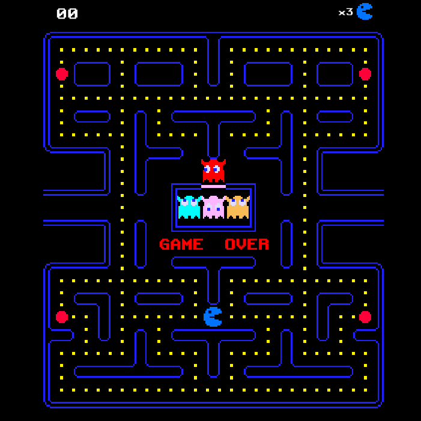

<div align = "center">

<h1><a href="https://2kabhishek.github.io/uPacman">uPacman</a></h1>

<a href="https://github.com/2KAbhishek/uPacman/blob/main/LICENSE">
 </a>

<a href="https://github.com/2KAbhishek/uPacman/graphs/contributors">
 </a>

<a href="https://github.com/2KAbhishek/uPacman/stargazers">
</a>

<a href="https://github.com/2KAbhishek/uPacman/network/members">
 </a>

<a href="https://github.com/2KAbhishek/uPacman/watchers">
 </a>

<a href="https://github.com/2KAbhishek/uPacman/pulse">
 </a>

<h3>Pacman recreated with Unity 🕹️🍒</h3>

<figure>
  
  <br/>
  <figcaption>uPacman screenshot</figcaption>
</figure>

</div>

## What is this

This is a modern recreation of Pacman built with Unity for learning purposes.

## Inspiration

Wanted to learn more about Unity and its ecosystem.

## Prerequisites

Before you begin, ensure you have met the following requirements:

- You have installed the latest version of `Unity Editor`

## Getting uPacman

To get uPacman, follow these steps:

```bash
git clone https://github.com/2kabhishek/uPacman
cd uPacman
```

Open the project using Unity Hub and open the `Game` scene, hit the play button to run the game.

## How it was built

uPacman was built using `Unity Editor`.

## Challenges faced

Building tilemaps for walls was challenging.

## What I learned

- Learned about the Unity ecosystem
- Tried out scripting using `C#`

## What's next

You tell me, PRs welcome.

Hit the ⭐ button if you found this useful.

## More Info

<div align="center">

<a href="https://github.com/2KAbhishek/uPacman">Source</a> | <a href="https://2kabhishek.github.io/uPacman">Website</a>

</div>
